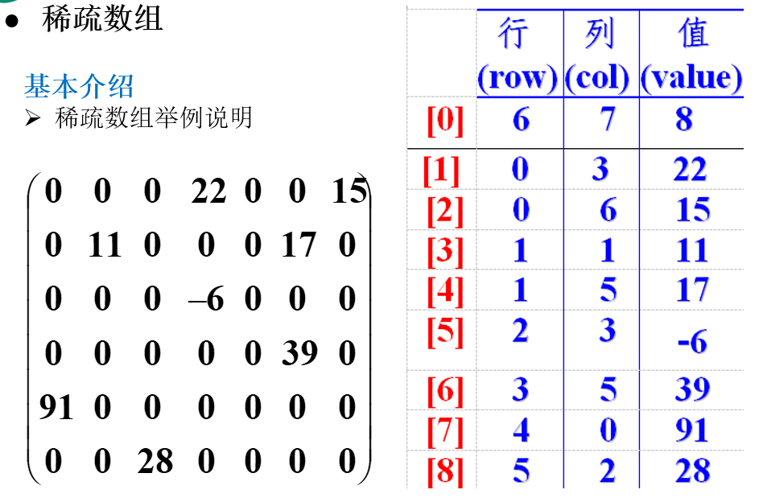

> 尚硅谷韩顺平老师 数据结构和算法


## 数据结构和算法的介绍


### 数据结构和算法的关系

- 数据(data)结构(structure)是一门**研究组织 数据]方式**的学科，有了编程语言也就有了数据结构.学好数据结构可以编写出更加漂亮,更加有效率的代码。

- 要学习好数据结构就要多多考虑如何将生活中遇到的问题,用程序去实现解决.

- **程序 = 数据结构 + 算法**

- 数据结构是算法的基础, 换言之，想要学好算法，需要把数据结构学到位。


## 线性结构和非线性结构

数据结构包括：**线性结构**和**非线性结构**。


- **线性结构**

1)线性结构作为最常用的数据结构，其特点是**数据元素之间存在一对一**的线性关系

2)线性结构有两种不同的存储结构，即**顺序存储结构(数组)**和**链式存储结构(链表)**。顺序存储的线性表称为顺序表，顺序表中的**存储元素是连续**的

3)链式存储的线性表称为链表，链表中的**存储元素不一定是连续的**，元素节点中存放数据元素以及相邻元素的地址信息

4)线性结构常见的有：**数组、队列、链表和栈**


- **非线性结构**

非线性结构包括：二维数组，多维数组，广义表，**树结构，图结构**


## **稀疏数组和队列**


### **基本介绍**

当一个数组中大部分元素为０，或者为同一个值的数组时，可以使用稀疏数组来保存该数组。


稀疏数组的处理方法是:

1)记录数组一共有几行几列，有多少个不同的值

2)把具有不同值的元素的行列及值记录在一个小规模的数组中，从而缩小程序的规模





### 应用实例

1)使用稀疏数组，来保留类似前面的二维数组(棋盘、地图等等)

2)把稀疏数组存盘，并且可以从新恢复原来的二维数组数

3)整体思路分析


### 代码实现

```java

```

